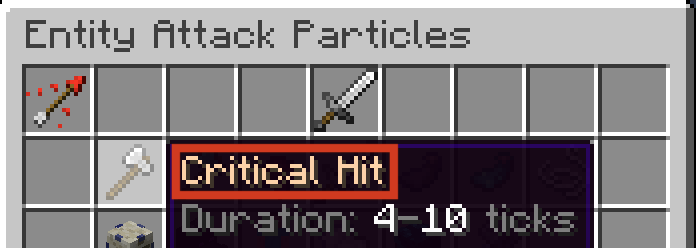

## Syntax
Particles are created using the `par` constructor. Like all constructors in Terracotta, the values passed into the constructor are [Expressions](../language_features/expressions.md) and can take full advantage of their features. 

```tc
par(Particle: str, Data: dict*)
```

If the data dictionary is omitted, all fields will use their default values.

`Particle` is the name of the potion that appears at the top of a particle effect's button, NOT its minecraft id.

```tc
par("Critical Hit")
```

{width="500"}

## Data Dictionary
Data about the behavior of a particle like amount, color, spread, etc. are provided inside of a dictionary at the end of the particle constructor.

```tc 
par["Dust",{
    "Amount" = 10,
    "Spread" = [1,1],
    "Color" = "#ff0000",
    "Color Variation" = 0
}]
```

!!! info 
    While the values passed into the `data` dictionary can be expressions, the dictionary itself cannot. 
    ```tc title="Valid"
    par("Flame",{"Amount" = num:Random(1,10)})
    ```
    ```tc title="Invalid"
    global data = {"Amount" = 10};
    par("Flame",global data)
    ```

The following are all the possible data fields. `Amount` and `Spread` can always be specified, the rest may or may not be available depending on the type of particle.

### Amount
A `num` specifying how many particles to spawn. 

Defaults to `1` if omitted.

### Spread
A `list` containing two `num`s, the first for horizontal spread and the second for vertical spread. The numbers inside the list can be expressions, however the list itself cannot.

Defaults to `[0,0]` if omitted.

```tc title="Example"
"Spread" = [0.5, 0] # Spawns particles in a flat disc.
```

### Motion
A `vec` specifying the velocity of the particles. Longer length vectors will result in faster movement. 

Defaults to `vec(1, 0, 0)` if omitted.

```tc title="Example"
"Motion" = vec(0, 5, 0) # Launches particles straight up.
```

### Motion Variation
A `num` (0-100) specifying how much to randomize the motion of the particles. Any digits after the decimal place will be removed by DiamondFire. `0` will mean the exact value of `Motion` is always used, `100` will mean the direction is completely random and the speed will be anywhere between 100% and 0% of the length of `Motion`. 

Defaults to `100` if omitted.

### Color
A `str` specifying the color of the particles as a hexadecimal RGB color. Six-digit and three-digit colors are both allowed, and a `#` at the beginning of the string is optional.

Defaults to `"#ff0000"` if omitted.

```tc title="Example"
# These are all valid ways to specify Color:
"Color" = "#8800ff"
"Color" = "#80f"
"Color" = "000000"
"Color" = "fff"
```

### Color Variation
A `num` (0-100) specifying how much to randomize the color of the particles. Any digits after the decimal place will be removed by DiamondFire. `0` will mean the exact value of `Color` is always used, `100` will mean the color is completely random.

Defaults to `0` if omitted.

### Fade Color
A `str` specifying the color to transition to. Uses the same syntax as [Color](particle.md#color).

Defaults to `"#000000"` if omitted.

### Material
A `str` specifying the material id of the particles. Uses item ids, NOT names.

Defaults to `"oak_log"` if omitted.

```tc title="Example"
"Material" = "diamond_block"
```

### Size
A `num` specifying the size of the particles.

Defaults to `1` if omitted.

### Size Variation
A `num` (0-100) specifying how much to randomize the size of the particles. Any digits after the decimal place will be removed by DiamondFire. `0` will mean the exact value of `Size` is always used, `100` will mean the size could be anywhere between 3*`Size` and 0.

Defaults to `0` if omitted.

### Roll
A `num` specifying the rotation of the particles.

!!! info "`Roll` uses RADIANS as a unit, not degrees. To convert from degrees to radians, use [this](https://www.google.com/search?q=degrees+to+radians)."

Defaults to `0` if omitted.


```tc title="Example"
"Roll" = 3.14159 # 180 degrees
```

### Opacity
A `num` (0-100) specifying the opacity of the particles. Any digits after the decimal place will be removed by DiamondFire. `0` is completely transparent, `100` is completely visible. 

Minecraft will round values of 10 and below down to 0 when displaying, meaning the most transparent a particle can be while still being visible will have an opacity of 11.

Defaults to `100` if omitted.

!!! warning 
    DiamondFire currently has a hard time handling particles that have the `Opacity` field. To prevent unexpected glitchy behavior, it's best to avoid any particles that have this field until DiamondFire fixes them.

## Operations

#### `txt` + `par`: `txt`
Converts the right Particle into a String then adds it onto the end of the left Styled Text.
```tc
s"Selected trail: " + par("Flame") = s"Selected Trail: Flame[1][0.0,0.0][1.0,0.0,0.0|100%]"
```

#### `par` + `txt`: `txt`
Converts the left Particle into a String then adds it at the beginning of the right Styled Text.
```tc
par("Bubble") + s" is a particle." = s"Bubble[1][0.0,0.0][1.0,0.0,0.0|100%] is a particle."
```