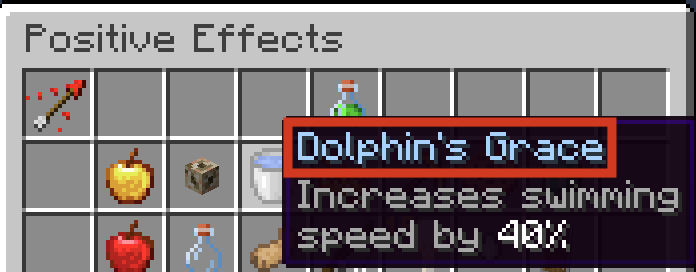

## Syntax
Potions are created using the `pot` constructor. Like all constructors in Terracotta, the values passed into the constructor are [Expressions](../language_features/expressions.md) and can take full advantage of their features.

```tc
pot(Potion: str, Amplifier: num*, Duration: num*)
```

`Amplifier` is optional and will default to `1` if omitted.

`Duration` is specified in ticks, meaning a duration of `20` is equal to one second. `Duration` is optional and will default to infinite if omitted.

```tc
# Terracotta can pre-calculate `15*20` as `300` and insert `300` directly into 
# the potion item meaning you can safely do multiplications like this without
# creating extra codeblocks. Both examples will compile to the exact same code.
pot("Regeneration", 1, 15*20)
pot("Regeneration", 1, 300)
```

`Potion` is the name of the potion that appears at the top of a potion effect's button, NOT its minecraft id.

```tc
pot("Dolphin's Grace", 1, 300)
```

{width="500"}


## Operations

#### `txt` + `pot`: `txt`
Converts the right Potion into a String then adds it onto the end of the left Styled Text.
```tc
s"Your curse: " + pot("Weakness", 2, 10*20) = s"Your curse: Weakness 2 - 0:10"
```

#### `pot` + `txt`: `txt`
Converts the left Potion into a String then adds it at the beginning of the right Styled Text.
```tc
pot("Wither", 5, 1200) + s" is very painful." = s"Wither 5 - 1:00 is very painful."
```