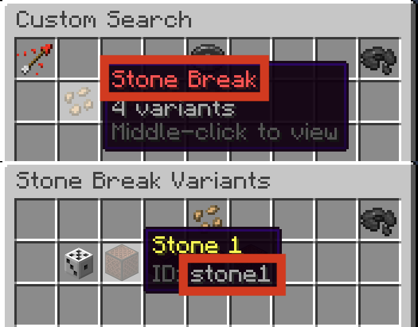

## Syntax
Sounds are created using the `snd` and `csnd` constructors. Like all constructors in Terracotta, the values passed into the constructor are [Expressions](../language_features/expressions.md) and can take full advantage of their features.

```tc
snd[Sound: str, Volume: num*, Pitch: num*, Variant: str*]
csnd[Sound: str, Volume: num*, Pitch: num*]
```

!!! warning "Constant numbers passed directly into the constructor will maintain their full precision, however if an expression that evaluates to a number is passed, that number's precision will be limited to three decimal places due to DiamondFire's precision limit."

`Volume` and `Pitch` default to `1` if omitted.
To play a random variant every time, omit the `Variant` argument.

When using the `snd` constructor, `Sound` is the name that appears at the top of a sound's button, and `Variant` is the ID that appears in the button's lore.
```tc
snd["Stone Break", 1, 1, "stone1"];
```
{ width="500" }

When using the `csnd` constructor, `Sound` is the minecraft id of the sound that would be used in a /playsound command. This allows the use of custom sounds provided by a plot resource pack.

```tc
# Custom sounds can be played.
csnd["item.custom_magic_wand.use"]

# Vanilla sounds can also be played with their Minecraft ids.
# Using csnd for vanilla sounds is not recommended as variants cannot
# be specified and a sound's Minecraft id may change between updates.
csnd["block.stone.break", 1, 0.8]
```

## Operations

### + (Addition)
#### `txt` + `snd`: `txt`
Converts the right Sound into a String then adds it onto the end of the left Styled Text.
```tc
s"Cool sound: " + snd["Stone Break", 1, 1, "stone1"] = s"Cool sound: Stone Break,stone1[1.0][1.0]"
```

#### `snd` + `txt`: `txt`
Converts the left Sound into a String then adds it at the beginning of the right Styled Text.
```tc
snd["Stone Break", 1, 1, "stone1"] + s" is a cool sound." = s"Stone Break,stone1[1.0][1.0] is a cool sound."
```