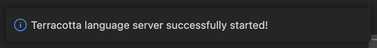
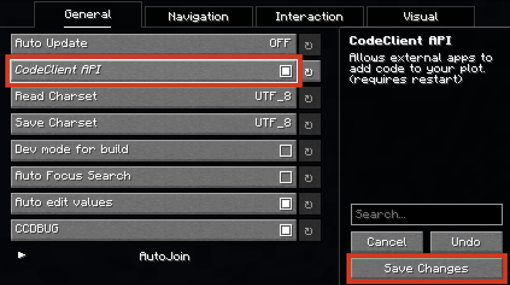

# Installation Guide

## 1. Install the VSCode Extension
!!! info "Official support for other editors isn't currently planned, though that might change in the future."
[Install VSCode](https://code.visualstudio.com/download) if you haven't already. It will be the editor you use to write Terracotta code.

The extension can be downloaded from the Extension Marketplace [here](), or by searching 'Terracotta' in the VSCode extensions tab. Once downloaded, it should set itself up automatically. If you see this message in the bottom right, that means it has successfully installed itself:

{width="500"}

For more information on everything the extension provides, see [Extension Features](). 

## 2. Set up CodeClient
Install the [CodeClient](https://modrinth.com/mod/codeclient) mod manually or using your launcher of choice. 

After it is installed, join DiamondFire and run `/ccconfig`. Under the General tab, turn on `CodeClient API` and click `Save Changes`. Restart the game if prompted to do so.

## That's it!
Terracotta is now ready for use. 

Next: [Learn how to compile your first plot.](plot_setup.md)