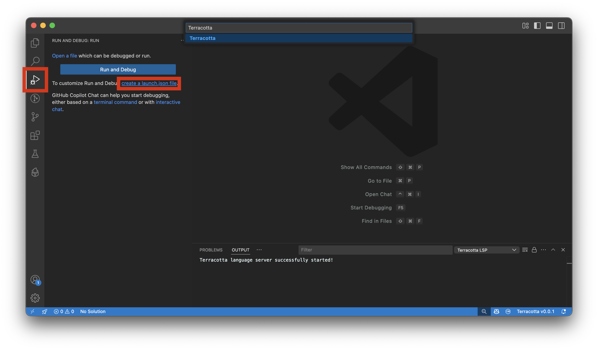
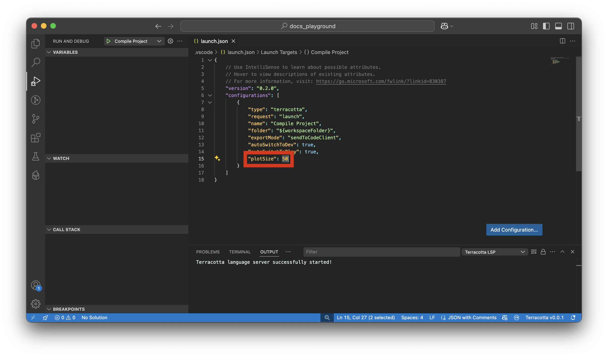

# Plot Setup

If you haven't already installed the VSCode extension and CodeClient, see [Installation](installation_guide.md).

!!! danger "Don't delete your code!"
    Always make sure to start with an empty plot. Never run Terracotta on plots made using normal DiamondFire coding because there is no way to recover code Terracotta may overwrite.

## Creating a Project
1. Choose a plot on DiamondFire to compile to and join it.
2. Create a folder to hold all your plot's code and open it in VSCode. 
3. From the Run and Debug menu, click `create a launch.json file` and select `Terracotta` from the list of langauges. 

4. In the newly created `launch.json` file, make sure to set `plotSize` appropriately for the plot you will be compiling to.


Plot Type | Plot Size
- | -
Basic | `50`
Large | `100`
Massive | `300`
Mega | `300`

??? info "All `launch.json` parameter explanations"
    - `folder`: The folder to compile. Pretty self-explanatory.
    - `exportMode`: Can be either `"sendToCodeClient"` or `"saveToFiles"`.
        - `"sendToCodeClient"`: When running, automatically place compiled templates via CodeClient.
        - `"saveToFiles"`: (CURRENTLY UNIMPLEMENTED!) When running, save all compiled templates to files.
    - `autoSwitchToDev`: If in play or build mode upon compiling, automatically enter dev mode. If left disabled, trying to compile while in build or play mode will fail. Only applies if `exportMode` is `"sendToCodeClient"`.
    - `autoSwitchToPlay`: Automatically enter play mode after all compiled templates have been placed.
    - `plotSize`: Used by the codeline splitter to know what length templates should be limited to. If you want to "disable" the codeline splitter, just set this to a very high number.

## Compiling a Project
Terracotta script files have the extension `.tc`. Create a script in your project folder to test with:

``` tc title="test.tc"
PLAYER_EVENT Join;

default:SendMessage("Hello world!");
```

In your Minecraft client, run the command `/auth`. This gives Terracotta permission to manipulate your plot using CodeClient. You will have to repeat this every time you restart either Minecraft or VSCode.

When you can see `CC Conected` in the bottom right of VSCode, press `f5` or click the green play symbol at the top of Run and Debug to compile your plot.

!!! warning
    Sometimes CodeClient will give up while trying to place code. If this happens, run `/abort` in your Minecraft client and try recompiling.

    If you find yourself getting stuck in a plot border, run `/worldplot <your plot size>`.

Next: [Get an overview of how Terracotta works](./language_overview.md)